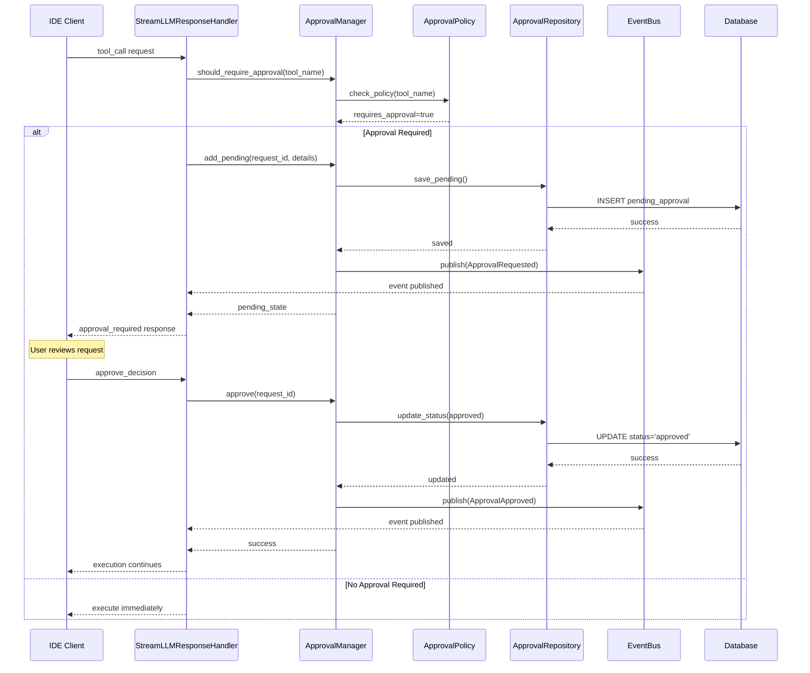
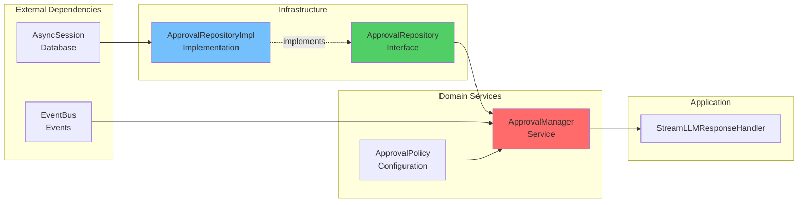
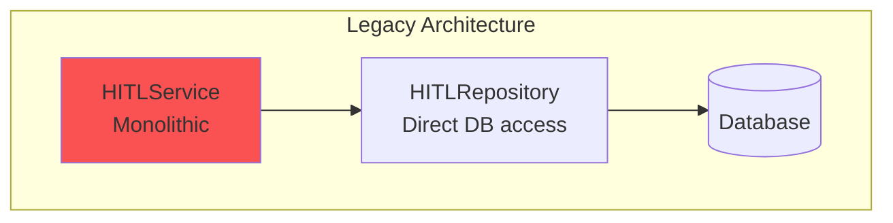
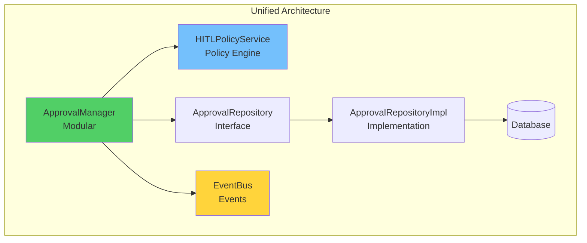

# Unified Approval System

**Версия**: 2.0.0  
**Дата**: 28 января 2026  
**Статус**: ✅ Production Ready

## Обзор

Unified Approval System — это централизованная система управления одобрениями (approvals) для всех типов запросов в Agent Runtime. Система заменяет legacy `HITLService` и предоставляет единый интерфейс для управления одобрениями инструментов, планов и других операций, требующих подтверждения пользователя.

## Архитектура

### Компоненты системы

```mermaid
graph TB
    subgraph "Presentation Layer"
        API[SessionsRouter<br/>API Endpoints]
    end
    
    subgraph "Application Layer"
        Handler[StreamLLMResponseHandler<br/>Обработка LLM ответов]
    end
    
    subgraph "Domain Layer"
        AM[ApprovalManager<br/>Управление одобрениями]
        HPS[HITLPolicyService<br/>Политики одобрений]
        Entities[ApprovalPolicy<br/>PendingApprovalState<br/>ApprovalRequestType]
    end
    
    subgraph "Infrastructure Layer"
        Repo[ApprovalRepository<br/>Интерфейс]
        RepoImpl[ApprovalRepositoryImpl<br/>Реализация]
        ORM[PendingApproval Model<br/>SQLAlchemy]
        DB[(PostgreSQL/SQLite)]
    end
    
    subgraph "Events"
        EB[EventBus<br/>Шина событий]
        Events[ApprovalRequested<br/>ApprovalApproved<br/>ApprovalRejected]
    end
    
    API --> Handler
    Handler --> AM
    AM --> HPS
    AM --> Repo
    Repo --> RepoImpl
    RepoImpl --> ORM
    ORM --> DB
    AM --> EB
    EB --> Events
    
    style AM fill:#ff6b6b
    style HPS fill:#74c0fc
    style EB fill:#ffd43b
    style Entities fill:#51cf66
```

### Слои архитектуры

#### 1. Presentation Layer (API)
- **SessionsRouter** - REST API endpoints для управления одобрениями
- Endpoints: `/sessions/{session_id}/hitl-decision`, `/sessions/{session_id}/pending-approvals`

#### 2. Application Layer
- **StreamLLMResponseHandler** - обрабатывает ответы LLM и запрашивает одобрения при необходимости

#### 3. Domain Layer
- **ApprovalManager** - центральный сервис управления одобрениями
- **HITLPolicyService** - проверка политик одобрений (встроен в ApprovalManager)
- **Entities** - доменные сущности (ApprovalPolicy, PendingApprovalState)

#### 4. Infrastructure Layer
- **ApprovalRepository** - интерфейс репозитория (Domain)
- **ApprovalRepositoryImpl** - реализация репозитория (Infrastructure)
- **PendingApproval Model** - ORM модель SQLAlchemy

#### 5. Events
- **EventBus** - публикация событий одобрений
- **ApprovalEvents** - типизированные события

---

## Approval Flow

### Последовательность обработки одобрения



### Сценарии использования

#### Сценарий 1: Tool Execution с одобрением

```python
# 1. LLM запрашивает выполнение инструмента
tool_call = {
    "name": "write_file",
    "arguments": {"path": "src/main.py", "content": "..."}
}

# 2. Проверка политики
requires, reason = await approval_manager.should_require_approval(
    request_type="tool",
    subject="write_file",
    details={"path": "src/main.py"}
)
# requires=True, reason="File modification requires approval"

# 3. Добавление в pending queue
await approval_manager.add_pending(
    request_id="call_123",
    request_type="tool",
    subject="write_file",
    session_id="session-abc",
    details=tool_call["arguments"],
    reason=reason
)

# 4. Отправка клиенту
return StreamChunk(type="tool_approval_required", call_id="call_123")

# 5. Пользователь одобряет
await approval_manager.approve("call_123")

# 6. Выполнение инструмента
result = await execute_tool(tool_call)
```

#### Сценарий 2: Отклонение одобрения

```python
# Пользователь отклоняет
await approval_manager.reject(
    request_id="call_123",
    reason="User cancelled operation"
)

# Система прекращает выполнение
return StreamChunk(type="error", content="Operation cancelled by user")
```

---

## Dependency Injection

### Граф зависимостей



### Конфигурация DI (FastAPI)

```python
# app/core/dependencies.py

async def get_approval_repository(
    db: AsyncSession = Depends(get_db)
) -> ApprovalRepository:
    """Provide ApprovalRepository implementation"""
    return ApprovalRepositoryImpl(db)

async def get_approval_manager(
    repo: ApprovalRepository = Depends(get_approval_repository)
) -> ApprovalManager:
    """Provide ApprovalManager with dependencies"""
    policy = ApprovalPolicy.default()
    return ApprovalManager(
        approval_repository=repo,
        approval_policy=policy
    )
```

---

## Доменные сущности

### ApprovalPolicy

Политика определяет, какие запросы требуют одобрения:

```python
class ApprovalPolicy(BaseModel):
    enabled: bool = True
    rules: List[ApprovalPolicyRule] = []
    default_requires_approval: bool = False
```

**Пример политики:**

```python
policy = ApprovalPolicy(
    enabled=True,
    rules=[
        ApprovalPolicyRule(
            request_type="tool",
            subject_pattern="write_file|execute_command",
            requires_approval=True,
            reason="Dangerous operation"
        ),
        ApprovalPolicyRule(
            request_type="tool",
            subject_pattern="read_file",
            requires_approval=False
        )
    ],
    default_requires_approval=False
)
```

### PendingApprovalState

Состояние ожидающего одобрения запроса:

```python
class PendingApprovalState(BaseModel):
    request_id: str
    request_type: str  # "tool", "plan"
    subject: str       # tool name, plan title
    session_id: str
    details: Dict[str, Any]
    reason: Optional[str]
    created_at: datetime
    status: Literal['pending', 'approved', 'rejected']
```

### ApprovalRequestType

Типы запросов:

```python
class ApprovalRequestType(str, Enum):
    TOOL = "tool"
    PLAN = "plan"
```

---

## Events (Event-Driven Architecture)

### Типы событий

```python
# app/events/approval_events.py

class ApprovalRequestedEvent(BaseEvent):
    """Событие: запрошено одобрение"""
    event_type = EventType.APPROVAL_REQUESTED
    event_category = EventCategory.APPROVAL
    
    request_id: str
    request_type: str
    subject: str
    reason: Optional[str]

class ApprovalApprovedEvent(BaseEvent):
    """Событие: одобрение подтверждено"""
    event_type = EventType.APPROVAL_APPROVED
    event_category = EventCategory.APPROVAL
    
    request_id: str
    request_type: str

class ApprovalRejectedEvent(BaseEvent):
    """Событие: одобрение отклонено"""
    event_type = EventType.APPROVAL_REJECTED
    event_category = EventCategory.APPROVAL
    
    request_id: str
    request_type: str
    reason: Optional[str]
```

### Публикация событий

```python
# В ApprovalManager
await event_bus.publish(
    ApprovalRequestedEvent(
        aggregate_id=request_id,
        session_id=session_id,
        request_id=request_id,
        request_type=request_type,
        subject=subject,
        reason=reason
    )
)
```

### Подписчики

События могут обрабатываться подписчиками для:
- Метрик (сколько одобрений запрошено/одобрено/отклонено)
- Аудита (логирование всех решений)
- Уведомлений (отправка в IDE)

---

## API Endpoints

### POST /sessions/{session_id}/hitl-decision

Отправить решение пользователя по одобрению.

**Request:**
```json
{
  "call_id": "call_123",
  "decision": "approve",
  "modified_arguments": {},
  "feedback": ""
}
```

**Decisions:**
- `approve` - одобрить выполнение
- `edit` - изменить параметры и одобрить
- `reject` - отклонить выполнение

**Response:** SSE stream с продолжением обработки

---

### GET /sessions/{session_id}/pending-approvals

Получить список ожидающих одобрений.

**Response:**
```json
{
  "pending_approvals": [
    {
      "call_id": "call_123",
      "tool_name": "write_file",
      "arguments": {
        "path": "src/main.py",
        "content": "..."
      },
      "reason": "File modification requires approval"
    }
  ]
}
```

---

## Сравнение: Before vs After

### Before: Legacy HITLService



**Проблемы:**
- ❌ Монолитный сервис с множественными ответственностями
- ❌ Прямой доступ к БД из Domain слоя
- ❌ Нет разделения политик и выполнения
- ❌ Отсутствие событий
- ❌ Сложно расширять для новых типов одобрений

### After: Unified Approval System



**Преимущества:**
- ✅ Модульная архитектура с четким разделением ответственностей
- ✅ Repository pattern - Domain не зависит от Infrastructure
- ✅ Политики отделены от выполнения
- ✅ Event-driven для интеграции и мониторинга
- ✅ Легко расширяется для новых типов (plans, deployments, etc.)
- ✅ Соблюдение Clean Architecture и SOLID

---

## Расширение системы

### Добавление нового типа одобрения

1. **Добавить тип в enum:**

```python
# app/domain/entities/approval.py
class ApprovalRequestType(str, Enum):
    TOOL = "tool"
    PLAN = "plan"
    DEPLOYMENT = "deployment"  # NEW
```

2. **Добавить правила в политику:**

```python
policy.rules.append(
    ApprovalPolicyRule(
        request_type="deployment",
        subject_pattern="production",
        requires_approval=True,
        reason="Production deployment requires approval"
    )
)
```

3. **Использовать ApprovalManager:**

```python
requires, reason = await approval_manager.should_require_approval(
    request_type="deployment",
    subject="production",
    details={"environment": "prod", "version": "1.2.3"}
)

if requires:
    await approval_manager.add_pending(
        request_id="deploy-123",
        request_type="deployment",
        subject="production",
        session_id=session_id,
        details={"environment": "prod", "version": "1.2.3"},
        reason=reason
    )
```

---

## Тестирование

### Unit Tests

```python
# tests/test_approval_manager.py

async def test_should_require_approval():
    """Test policy evaluation"""
    manager = ApprovalManager(mock_repo, policy)
    
    requires, reason = await manager.should_require_approval(
        request_type="tool",
        subject="write_file",
        details={}
    )
    
    assert requires is True
    assert "File modification" in reason
```

### Integration Tests

```python
# tests/test_approval_manager_integration.py

async def test_approval_flow():
    """Test full approval flow with database"""
    # Add pending
    await manager.add_pending(
        request_id="test-123",
        request_type="tool",
        subject="write_file",
        session_id="session-1",
        details={"path": "test.py"}
    )
    
    # Get pending
    approval = await manager.get_pending("test-123")
    assert approval.status == "pending"
    
    # Approve
    await manager.approve("test-123")
    
    # Verify
    approval = await manager.get_pending("test-123")
    assert approval.status == "approved"
```

---

## Метрики и мониторинг

### Ключевые метрики

- **approval_requests_total** - общее количество запросов одобрений
- **approval_approved_total** - количество одобренных
- **approval_rejected_total** - количество отклоненных
- **approval_pending_duration** - время ожидания одобрения
- **approval_by_type** - распределение по типам (tool, plan)

### Логирование

```python
logger.info(
    f"Approval requested: "
    f"id={request_id}, type={request_type}, subject={subject}"
)

logger.info(
    f"Approval approved: id={request_id}"
)

logger.info(
    f"Approval rejected: id={request_id}, reason={reason}"
)
```

---

## Миграция с HITLService

### Шаги миграции

1. ✅ Создан ApprovalManager с Repository pattern
2. ✅ Создан ApprovalRepository интерфейс
3. ✅ Реализован ApprovalRepositoryImpl
4. ✅ Добавлены события одобрений
5. ✅ Обновлены зависимости в DI
6. ✅ Обновлены тесты
7. ✅ Удален legacy HITLService

### Обратная совместимость

Для обратной совместимости сохранены:
- Endpoint `/sessions/{session_id}/hitl-decision`
- Формат ответов API
- Структура БД (таблица `pending_approvals`)

---

## Ссылки

### Исходный код

- [`ApprovalManager`](../app/domain/services/approval_management.py)
- [`ApprovalRepository`](../app/domain/repositories/approval_repository.py)
- [`ApprovalRepositoryImpl`](../app/infrastructure/persistence/repositories/approval_repository_impl.py)
- [`ApprovalPolicy`](../app/domain/entities/approval.py)
- [`ApprovalEvents`](../app/events/approval_events.py)

### Документация

- [README.md](../README.md)
- [Event-Driven Architecture](EVENT_DRIVEN_ARCHITECTURE.md)
- [Clean Architecture Audit](../../../doc/agent-runtime-clean-architecture-audit.md)

---

© 2026 Codelab Contributors  
MIT License
