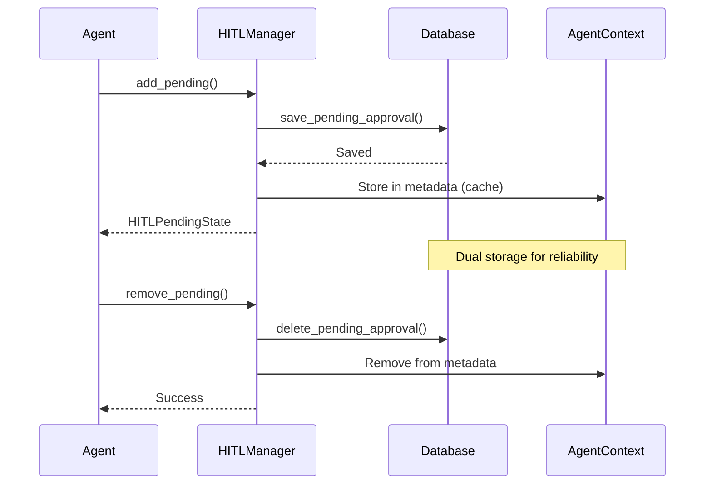

# HITL (Human-in-the-Loop) Implementation

**Версия:** 1.0.0
**Дата:** 20 января 2026
**Статус:** ✅ Реализовано

## Обзор

Реализация механизма Human-in-the-Loop (HITL) для одобрения опасных операций агента перед их выполнением. Система включает персистентное хранение в PostgreSQL/SQLite и полную интеграцию с мультиагентной системой.

## Архитектура

### Компоненты

1. **Policy Engine** ([`hitl_policy_service.py`](../agent-runtime/app/services/hitl_policy_service.py))
   - Определяет какие инструменты требуют одобрения
   - Поддержка wildcard паттернов для имен инструментов
   - Конфигурируемые правила через `HITLPolicy`

2. **HITL Manager** ([`hitl_manager.py`](../agent-runtime/app/services/hitl_manager.py))
   - Управление pending состояниями tool calls
   - Хранение в `AgentContext.metadata`
   - Аудит логирование всех решений

3. **Models** ([`hitl_models.py`](../agent-runtime/app/models/hitl_models.py))
   - `HITLDecision` - enum для решений (approve/edit/reject)
   - `HITLPolicy` - конфигурация политики
   - `HITLUserDecision` - решение пользователя
   - `HITLPendingState` - состояние ожидающего одобрения
   - `HITLAuditLog` - лог аудита

4. **WebSocket Protocol** ([`websocket.py`](../gateway/app/models/websocket.py))
   - `WSHITLDecision` - сообщение с решением от IDE

## Поток работы

```
1. LLM генерирует tool_call
   ↓
2. Policy Engine проверяет requires_approval
   ↓
3. Если требуется одобрение:
   - Сохраняем HITLPendingState в AgentContext
   - Отправляем tool_call с requires_approval=true в IDE
   - Ждем hitl_decision от пользователя
   ↓
4. Пользователь принимает решение в IDE
   ↓
5. IDE отправляет hitl_decision (approve/edit/reject)
   ↓
6. Agent-runtime обрабатывает решение:
   - approve → выполняем tool с оригинальными аргументами
   - edit → выполняем tool с modified_arguments
   - reject → отправляем feedback в LLM, не выполняем
   ↓
7. Логируем в HITLAuditLog
   ↓
8. Удаляем pending состояние
   ↓
9. Продолжаем работу агента
```

## Конфигурация Policy

По умолчанию требуют одобрения:
- `write_file` - запись файлов
- `delete_file` - удаление файлов
- `execute_command` - выполнение команд
- `create_directory` - создание директорий
- `move_file` - перемещение файлов

Безопасные операции (не требуют одобрения):
- `read_file` - чтение файлов
- `list_files` - список файлов
- `search_files` - поиск файлов

### Пример кастомной политики

```python
from app.models.hitl_models import HITLPolicy, HITLPolicyRule
from app.services.hitl_policy_service import hitl_policy_service

custom_policy = HITLPolicy(
    enabled=True,
    rules=[
        HITLPolicyRule(
            tool_name="write_*",  # wildcard pattern
            requires_approval=True,
            reason="All write operations require approval"
        ),
        HITLPolicyRule(
            tool_name="read_sensitive_*",
            requires_approval=True,
            reason="Sensitive data access"
        )
    ],
    default_requires_approval=False
)

hitl_policy_service.update_policy(custom_policy)
```

## WebSocket Protocol

### Tool Call с требованием одобрения

```json
{
  "type": "tool_call",
  "call_id": "call_abc123",
  "tool_name": "write_file",
  "arguments": { "path": "/src/main.py", "content": "..." },
  "requires_approval": true
}
```

### Решения пользователя

**Одобрить:**
```json
{
  "type": "hitl_decision",
  "call_id": "call_abc123",
  "decision": "approve"
}
```

**Редактировать:**
```json
{
  "type": "hitl_decision",
  "call_id": "call_abc123",
  "decision": "edit",
  "modified_arguments": { "path": "/src/main_v2.py" }
}
```

**Отклонить:**
```json
{
  "type": "hitl_decision",
  "call_id": "call_abc123",
  "decision": "reject",
  "feedback": "Operation too risky"
}
```

## Аудит и логирование

Все HITL решения логируются в `AgentContext.metadata['hitl_audit_logs']`:

```python
from app.services.hitl_manager import hitl_manager

# Получить все аудит логи для сессии
audit_logs = hitl_manager.get_audit_logs(session_id)

for log in audit_logs:
    print(f"Tool: {log.tool_name}")
    print(f"Decision: {log.decision}")
    print(f"Timestamp: {log.timestamp}")
```

## Управление pending состояниями

```python
from app.services.hitl_manager import hitl_manager

# Получить все pending tool calls
pending_calls = hitl_manager.get_all_pending(session_id)

# Очистить expired pending states
expired_count = hitl_manager.cleanup_expired(session_id)
```

## Интеграция с IDE

IDE должна:

1. **Обрабатывать tool_call с `requires_approval=true`**
   - Показать пользователю диалог с деталями операции
   - Предоставить опции: Approve / Edit / Reject

2. **Отправлять hitl_decision**
   - После решения пользователя отправить соответствующее сообщение

3. **Обрабатывать timeout**
   - Pending состояния истекают через 5 минут (по умолчанию)
   - IDE должна обрабатывать timeout и уведомлять пользователя

## Тестирование

```bash
# Запустить тесты
cd agent-runtime
pytest tests/ -v -k hitl
```

## Отключение HITL

```python
from app.services.hitl_policy_service import hitl_policy_service

# Отключить глобально
hitl_policy_service.disable()

# Включить обратно
hitl_policy_service.enable()
```

## Безопасность

- Все HITL решения логируются для аудита
- Pending состояния автоматически истекают (timeout)
- Policy engine поддерживает гибкую конфигурацию
- Возможность редактирования параметров перед выполнением

## Производительность

- Dual storage: Database (persistence) + AgentContext (fast access)
- Минимальный overhead для безопасных операций
- Асинхронная обработка решений
- Background persistence для batch operations

## ✅ Реализованные возможности

- ✅ **Персистентное хранение** pending состояний в PostgreSQL/SQLite
- ✅ **Database persistence** через async SQLAlchemy
- ✅ **Dual storage** - database (source of truth) + in-memory (fast access)
- ✅ **Audit logging** всех HITL решений
- ✅ **Policy engine** с wildcard patterns
- ✅ **Timeout механизм** для pending approvals
- ✅ **Интеграция с мультиагентной системой**
- ✅ **Recovery after restart** - восстановление pending approvals из БД

## 📋 Будущие улучшения

- [ ] **Ролевые политики** - разные правила для разных пользователей/ролей
- [ ] **UI для управления политиками** - веб-интерфейс для настройки HITL правил
- [ ] **Статистика и аналитика** - dashboard с метриками HITL решений
- [ ] **Автоматическое обучение** - ML модель для предсказания решений пользователя
- [ ] **Batch approvals** - одобрение нескольких операций одновременно
- [ ] **Approval templates** - шаблоны для часто используемых операций
- [ ] **Notification system** - уведомления о pending approvals

## 🔧 Техническая реализация

### Database Schema

```sql
CREATE TABLE pending_approvals (
    id UUID PRIMARY KEY DEFAULT gen_random_uuid(),
    session_id UUID NOT NULL REFERENCES sessions(id) ON DELETE CASCADE,
    call_id VARCHAR(255) NOT NULL UNIQUE,
    tool_name VARCHAR(100) NOT NULL,
    arguments JSONB NOT NULL,
    reason TEXT,
    created_at TIMESTAMP DEFAULT NOW(),
    expires_at TIMESTAMP,
    
    INDEX idx_pending_approvals_session (session_id),
    INDEX idx_pending_approvals_call_id (call_id)
);
```

### Persistence Flow



### Recovery After Restart

При перезапуске IDE или Agent Runtime:
1. Pending approvals загружаются из database
2. Восстанавливается состояние сессии
3. IDE может продолжить с того же места
4. Пользователь видит все pending approvals

**Endpoint для восстановления**:
```http
GET /sessions/{session_id}/pending-approvals
```

**Response**:
```json
{
  "pending_approvals": [
    {
      "call_id": "call_abc123",
      "tool_name": "write_file",
      "arguments": {"path": "src/main.py", "content": "..."},
      "reason": "File modification requires approval",
      "created_at": "2024-01-09T10:00:00Z",
      "expires_at": "2024-01-09T10:05:00Z"
    }
  ]
}
```

## 📚 Дополнительные ресурсы

- [HITL Implementation Summary](HITL_IMPLEMENTATION_SUMMARY.md) - Краткое резюме
- [Agent Protocol](/docs/api/agent-protocol) - Протокол агента
- [WebSocket Protocol](/docs/api/websocket-protocol) - WebSocket протокол
- [Мультиагентная система](/docs/api/multi-agent-system) - Документация по агентам
