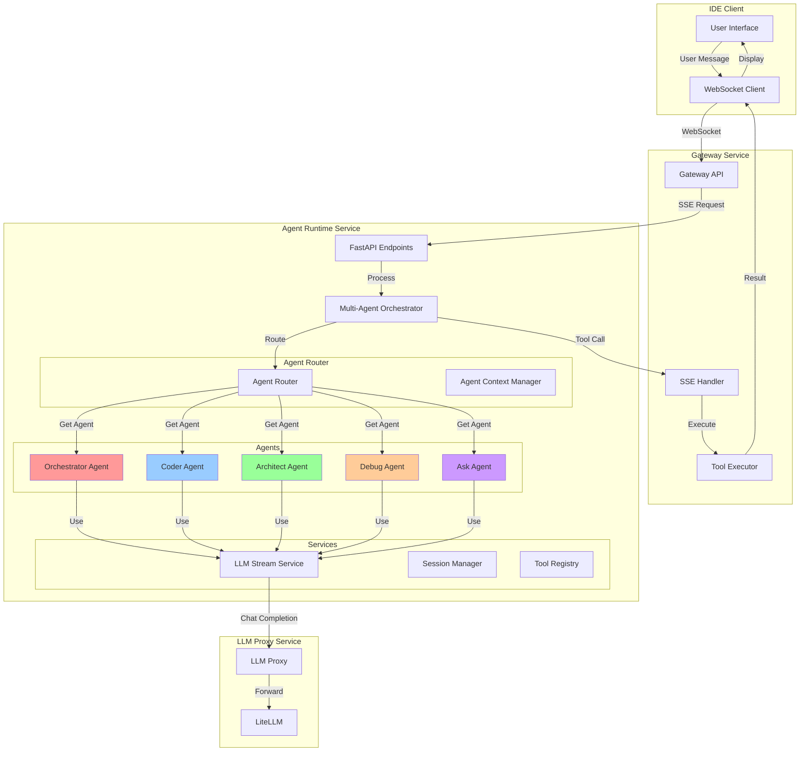
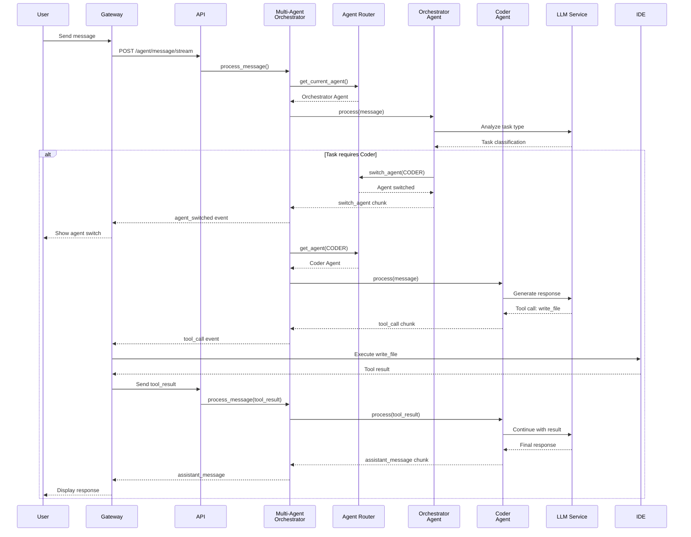
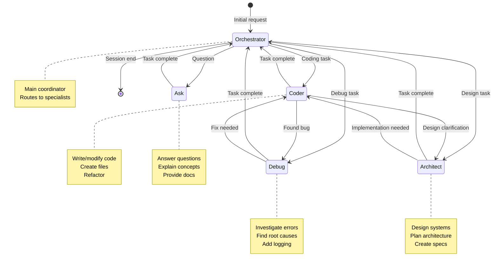
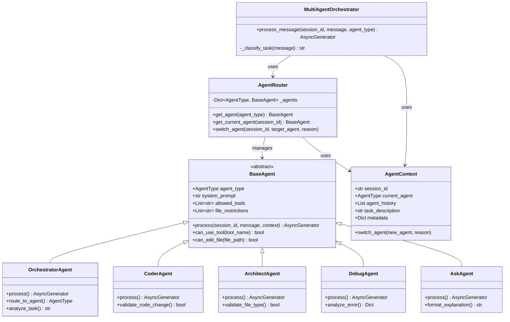
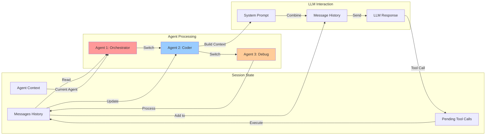
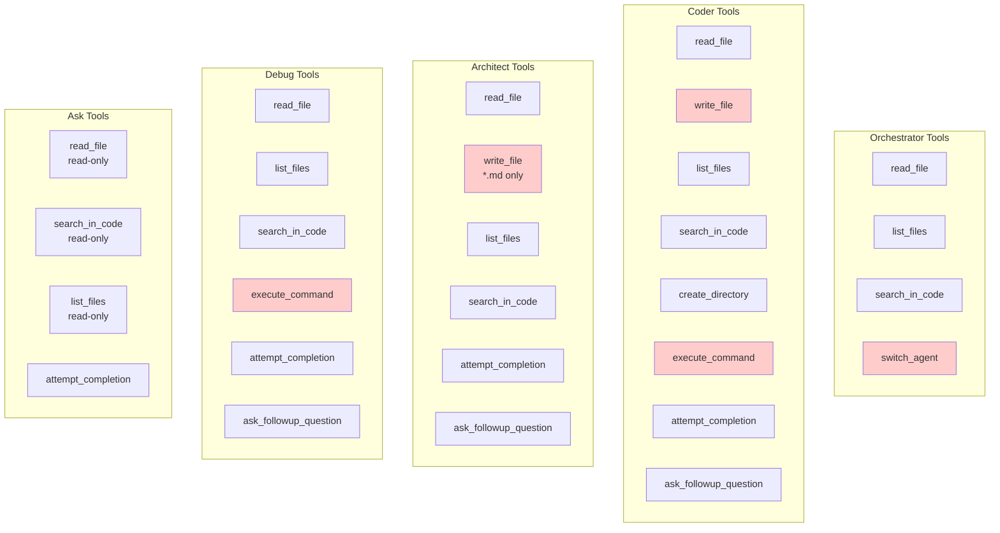
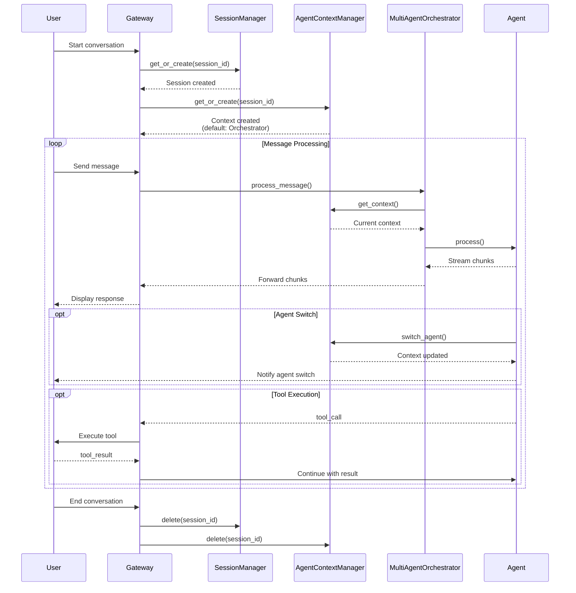
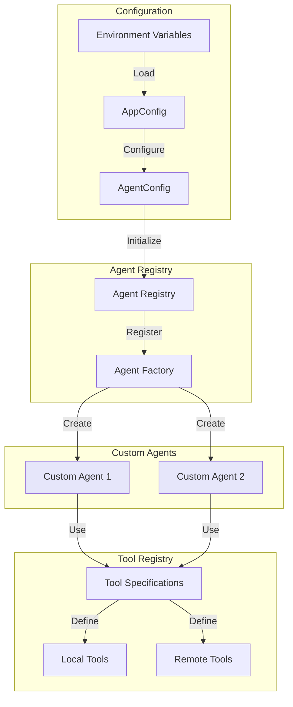

# Диаграммы мультиагентной архитектуры

## 1. Общая архитектура системы

## 2. Поток обработки сообщения

## 3. Переключение между агентами

## 4. Структура классов агентов

## 5. Поток данных в сессии

## 6. Инструменты по агентам

## 7. Жизненный цикл сессии

## 8. Конфигурация и расширяемость

## Ключевые преимущества архитектуры

### 1. Модульность
- Каждый агент - независимый модуль
- Легко добавлять новых агентов
- Четкое разделение ответственности

### 2. Гибкость
- Динамическое переключение агентов
- Настраиваемые ограничения
- Расширяемый набор инструментов

### 3. Масштабируемость
- Агенты могут работать параллельно
- Кэширование контекстов
- Оптимизация LLM запросов

### 4. Безопасность
- Ограничения по файлам
- Валидация инструментов
- Контроль доступа

### 5. Наблюдаемость
- Логирование всех переключений
- Метрики по агентам
- Трассировка запросов
