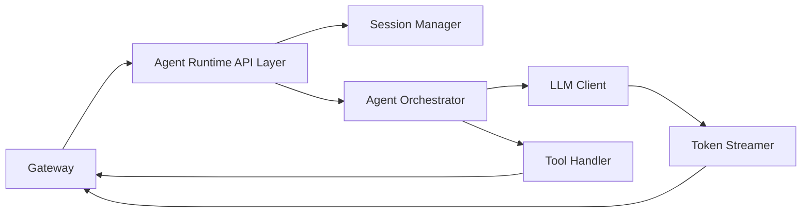
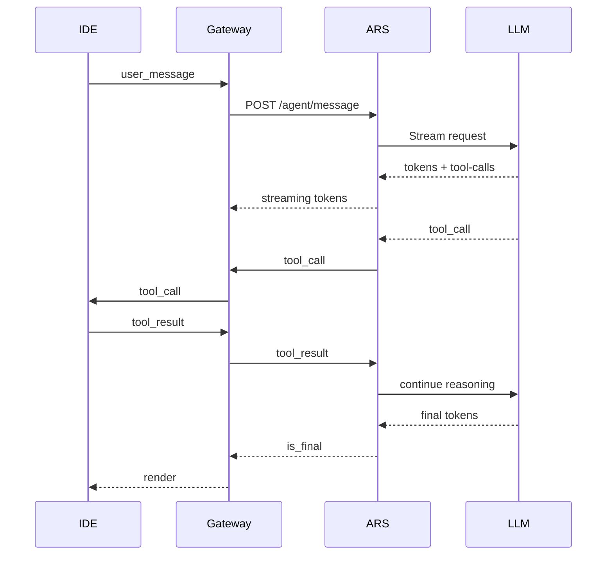

# Техническое задание: Agent Runtime Service

**Версия:** 1.0.0
**Дата:** 20 января 2026
**Статус:** ✅ Реализовано

---

# 1. Назначение системы

**Agent Runtime Service (ARS)** — это центральный серверный компонент, реализующий:

* основную логику AI Agent-а
* управление сессиями и цепочками reasoning
* потоковую работу с LLM
* выполнение tool-calls через Gateway/IDE
* управление workflow (Patch Review, User Approval, Commands, File Ops, Git Ops)
* обработку мультимодальных сообщений (будет добавлено в расширении)

Agent Runtime Service НЕ работает с Git, файлами и командной строкой локально.
Все инструменты исполняются через IDE ⇒ Gateway.

ARS — это **мозг агента**, IDE — руки, Gateway — транспорт.

---

# 2. Требования MVP

MVP ARS должен поддерживать:

* Приём сообщений от Gateway (REST или WebSocket)
* Управление сессией агента
* Обработку user_message
* Tool invocation flow
* Поддержку streaming вывода LLM в Gateway
* Basic memory per-session (in-memory store)
* Patch Review управление (интерактивный diff)
* User Approval через tool:prompt_user
* Диагностику и логирование

Расширенные возможности (не входят в MVP):

* Multi-agent pipelines
* Длительные фоновые задачи
* Расширенная Retrieval система
* Persistent user memory
  (будет добавлено в версии 1.1)

---

# 3. Архитектура ARS



## Компоненты:

### 3.1 API Layer

REST или WebSocket endpoint, принимающий сообщения от Gateway.

### 3.2 Session Manager

* хранение состояния диалога (context, pending tool-calls, last messages)
* хранение цепочек reasoning

### 3.3 Agent Orchestrator

Главный компонент, который:

* вызывает LLM
* управляет планированием действий агента
* обрабатывает tool-calls
* контролирует multistep reasoning
* собирает финальный вывод

### 3.4 LLM Client

* взаимодействие с LLM через streaming API
* отправляет токены в Gateway
* отслеживает tool-calls, встроенные в ответ модели

### 3.5 Tool Handler

Концентратор всех инструментов:

* read_file
* write_file
* git.diff
* apply_patch
* run_command
* apply_patch_review
* prompt_user
* list_files
* search_in_project

Tool Handler не выполняет инструменты локально — он отправляет tool-call через Gateway → IDE.

### 3.6 Token Streamer

Компонент, который:

* конвертирует chunk-и моделей в JSON токены
* отправляет их в Gateway
* обеспечивает delivery confirmation

---

# 4. Протоколы и API

## 4.1 Endpoint для получения пользовательских сообщений

```
POST /agent/message
```

### Request:

```json
{
  "session_id": "sess_1",
  "message": {
    "type": "user_message",
    "message_id": "msg_123",
    "content": "Refactor auth module"
  }
}
```

### Response:

```json
{ "status": "accepted" }
```

После этого ARS начинает streaming через Gateway.

---

## 4.2 Streaming токенов ARS → Gateway

Формат:

```json
{
  "type": "assistant_message",
  "session_id": "sess_1",
  "message_id": "msg_123",
  "token": "import",
  "is_final": false
}
```

### Завершение:

```json
{
  "type": "assistant_message",
  "session_id": "sess_1",
  "message_id": "msg_123",
  "is_final": true
}
```

---

## 4.3 Сообщение Gateway → ARS (tool_result)

```
POST /agent/tool_result
```

Request:

```json
{
  "session_id": "sess_1",
  "call_id": "call_77",
  "result": {
    "content": "file text"
  }
}
```

Response:

```json
{ "status": "received" }
```

---

# 5. Поддерживаемые инструменты (tools)

Все инструменты передаются в формате:

### Tool call

```json
{
  "type": "tool_call",
  "call_id": "call_77",
  "tool_name": "read_file",
  "args": {
    "path": "src/main.dart"
  }
}
```

### Tool result

```json
{
  "type": "tool_result",
  "call_id": "call_77",
  "result": {
    "content": "..."
  }
}
```

### MVP tools:

| Tool name          | Назначение                           |
| ------------------ | ------------------------------------ |
| read_file          | Чтение файлов на машине пользователя |
| write_file         | Запись данных                        |
| list_files         | Дерево файлов                        |
| git.diff           | Получение diff                       |
| apply_patch        | Применение патчей                    |
| apply_patch_review | Интерактивный выбор chunk            |
| run_command        | Выполнение shell                     |
| prompt_user        | Запрос подтверждения                 |

---

# 6. Workflow

## 6.1 User message flow



---

## 6.2 Patch Review flow

1. Модель создаёт diff → отправляет tool_call:apply_patch_review
2. IDE показывает diff
3. Пользователь выбирает chunk-и
4. IDE отправляет filtered diff
5. ARS продолжает reasoning
6. Модель создаёт `apply_patch`
7. IDE применяет патч

---

## 6.3 User Approval flow (prompt_user)

1. Модель вызывает `prompt_user`
2. Gateway пересылает запрос IDE
3. IDE выводит модал
4. Пользователь подтверждает
5. Результат отправляется в ARS
6. Модель продолжает reasoning

---

# 7. Требования к LLM интеграции

ARS должен поддерживать LLM поставщика, позволяющего:

* streaming токены
* встроенные tool-calls
* частичные reasoning steps
* токеновые лимиты не менее 100k context

Минимальные требования:

* модели: GPT-4.1, Llama 3.1, Claude 3.5
* API: OpenAI API-compatible

---

# 8. Session architecture

Каждая сессия содержит:

```json
{
  "session_id": "sess_1",
  "history": [],
  "pending_tool_call": null,
  "last_user_message": null,
  "llm_state": {},
  "metadata": {}
}
```

Хранение — in-memory (Redis-ready архитектура).

---

# 9. Ошибки и fault tolerance

### Ошибки:

* INVALID_MESSAGE
* TOOL_TIMEOUT
* LLM_ERROR
* LLM_STREAM_INTERRUPTED
* GATEWAY_UNREACHABLE

### Recovery:

* повторная отправка токенов при reconnect
* auto-retry tool-calls
* сохранение partial state

---

# 10. Логирование

* Все входящие и исходящие запросы
* Tool-calls
* Ошибки и таймауты
* Время генерации и полный trace reasoning

Письмо в JSON через structlog.

---

# 11. Нефункциональные требования

### Performance

* Задержка ответа < 150мс до начала streaming
* Скорость стриминга > 200 токенов/сек

### Scalability

* Поддержка лёгкого шардирования по session_id
* Внешний стейт можно вынести в Redis или Postgres

### Security

* Gateway должен быть единственным входом
* API ARS не публикуется в публичный интернет

---

# 12. План разработки MVP

### Неделя 1: Core

* Session Manager
* API Layer
* LLM client (streaming)
* Message Router

### Неделя 2: Tools + workflows

* Tool Handler
* Patch Review flow
* User Approval flow
* Error recovery
* Logging & Observability

### Неделя 3: Testing & integration

* Gateway integration tests
* Codelab IDE E2E tests
* Load tests
* Documentation

---

# 13. Acceptance Criteria

ARS считается готовым, когда:

* Передает токены в IDE через Gateway в реальном времени
* Поддерживает tool-calls всех типов
* Умеет обрабатывать Patch Review и prompt_user
* Корректно завершает сессии
* Восстанавливается после ошибок
* Покрыт тестами на 70% ключевой логики
