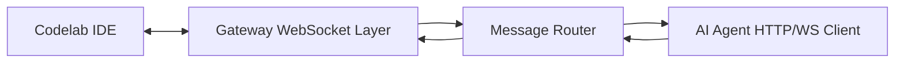

# Техническое задание: Gateway Service

**Версия:** 1.0.0
**Дата:** 20 января 2026
**Статус:** ✅ Реализовано

---

# 1. Назначение системы

**Gateway Service** — это сервис-прокси, обеспечивающий двунаправленную связь между:

* **Codelab IDE Desktop** (macOS, Windows, Linux)
* **AI Agent Service** (облачный или локальный)

Gateway выполняет:

* установление и управление WebSocket соединением с IDE
* получение запросов от IDE и маршрутизация их в AI Agent
* получение stream-токенов от AI Agent и отправку токенов обратно в IDE
* маршрутизацию tool-call запросов и их результатов
* поддержку нескольких IDE клиентов одновременно
* гарантированную доставку сообщений в рамках одной сессии

**Gateway не выполняет бизнес-логику AI Agent.**
Gateway — это тонкий транспортный слой.

---

# 2. Требования MVP

### MVP включает:

* WebSocket сервер
* Поддержку нескольких клиентских сессий
* JSON-протокол обмена
* Маршрутизацию сообщений IDE → Agent
* Поддержку streaming токенов Agent → IDE
* Обработку disconnection/reconnect
* Отправку ACK сообщений
* Лёгкое горизонтальное масштабирование (через Redis pub/sub)

---

# 3. Архитектура Gateway



## Основные компоненты:

### 3.1 WebSocket Layer

* принимает входящее WebSocket соединение
* идентифицирует его по `session_id`
* отправляет/получает JSON-сообщения

### 3.2 Session Manager

* хранит активные подключения IDE
* хранит состояние сессий

### 3.3 Message Router

* маршрутизирует входящие сообщения
* отделяет system-traffic от user-traffic
* обрабатывает tool-call → Agent API → tool-result

### 3.4 AI Agent Client

* соединение с AI Agent по REST + Streaming (SSE/WebSocket)
* проксирует токены к IDE

---

# 4. Протоколы и API

## 4.1 WebSocket endpoint

```
ws://gateway_host/ws/{session_id}
```

### Поведение:

* при подключении создаётся новая сессия
* при разрыве соединения сессия очищается

---

# 5. Форматы сообщений (JSON-протокол)

## 5.1 Сообщение от IDE → Gateway

### Типы:

1. `user_message`
2. `tool_result`
3. `system_event`

### Формат:

```json
{
  "type": "user_message",
  "message_id": "msg_123",
  "content": "Refactor project to use new authentication"
}
```

---

## 5.2 Сообщение Gateway → Agent

```json
{
  "session_id": "abc123",
  "message": {
    "type": "user_message",
    "message_id": "msg_123",
    "content": "Refactor project"
  }
}
```

---

## 5.3 Streaming токены Agent → Gateway

Формат:

```json
{
  "type": "assistant_message",
  "message_id": "msg_123",
  "token": "import",
  "is_final": false
}
```

---

## 5.4 Streaming токены Gateway → IDE

Идентичный:

```json
{
  "type": "assistant_message",
  "message_id": "msg_123",
  "token": "import",
  "is_final": false
}
```

---

## 5.5 Tool Call от Agent → Gateway → IDE

```json
{
  "type": "tool_call",
  "call_id": "call_77",
  "tool_name": "read_file",
  "args": { "path": "src/main.dart" }
}
```

---

## 5.6 Tool Result от IDE → Gateway → Agent

```json
{
  "type": "tool_result",
  "call_id": "call_77",
  "result": { "content": "file data..." }
}
```

---

# 6. Поведение Gateway

## 6.1 Приём user_message

1. IDE отправляет `user_message`
2. Gateway отправляет immediate ACK:

```json
{ "status": "received", "message_id": "msg_123" }
```

3. Gateway пересылает сообщение в Agent

---

## 6.2 Streaming tokens

1. Agent начинает стримить токены
2. Gateway пересылает их IDE
3. Если IDE отсоединилась — Gateway буферизует *последние 10 токенов*
4. После reconnect — отсылает buffered tokens
5. После is_final=true — сообщение считается завершённым

---

## 6.3 Tool-calls workflow

1. Agent отправляет `tool_call`
2. Gateway пересылает его IDE
3. IDE выполняет tool locally
4. IDE отправляет `tool_result`
5. Gateway пересылает результат Agent

---

# 7. Ошибки и Fault tolerance

## 7.1 Формат ошибки

```json
{
  "type": "error",
  "code": "INVALID_FORMAT",
  "message": "Message missing required field: type"
}
```

## Ошибки:

* `INVALID_FORMAT`
* `INVALID_SESSION`
* `AGENT_DOWN`
* `TOOL_TIMEOUT`
* `WS_DISCONNECTED`

---

# 8. Логирование

## Уровни:

* **INFO** — подключения, tool-calls, сообщения
* **WARNING** — нестандартные ситуации
* **ERROR** — падения Agent, разрывы, невозможность доставить токены

Все логи пишутся через `structlog` в JSON-формате.

---

# 9. Нефункциональные требования

* Поддержка *минимум 100* одновременных сессий (MVP)
* Задержка forwarding < **5мс**
* Пропускная способность streaming > **200 токенов/сек**
* Время восстановления после reconnect < **200мс**

---

# 10. Технологический стек

| Задача            | Технология         |
| ----------------- | ------------------ |
| WebSocket         | FastAPI (ASGI)     |
| HTTP Client       | Aiohttp            |
| Streaming (Agent) | HTTP chunked / SSE |
| Typing/Validation | Pydantic           |
| Logging           | structlog          |
| Server            | Uvicorn            |
| Optional scaling  | Redis, Docker      |

---

# 11. Min viable архитектура MVP

```text
FastAPI
│
├── websocket_router.py
├── session_manager.py
├── agent_client.py
├── message_router.py
├── schemas.py
└── config.py
```

---

# 12. План разработки MVP

### День 1–2

* Проект, WebSocket endpoint, session manager

### День 3–4

* Message router, Pydantic схемы

### День 5–6

* Agent клиента + HTTP streaming

### День 7

* Tool-call routing

### День 8

* Error handling + reconnect flow

### День 9

* Логирование, нагрузочные тесты

### День 10

* Интеграция с Codelab IDE

---

# 13. Acceptance Criteria (готовность MVP)

* IDE подключается к WebSocket
* IDE отправляет сообщения → Agent → IDE получает токены
* Streaming работает token-by-token
* Tool-calls работают от Agent → IDE → Agent
* Соединение восстанавливается после disconnect
* Логи корректны
* Нет утечек памяти или зависших сессий
