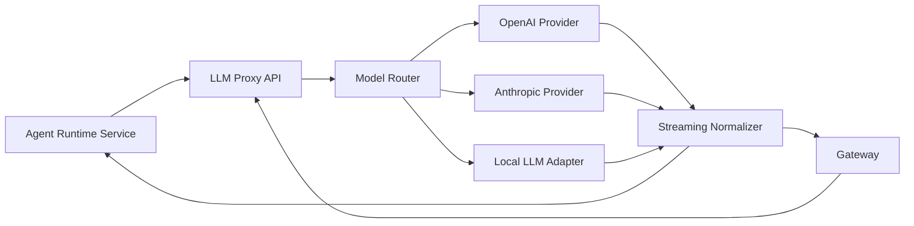

# Техническое задание: LLM Proxy Service

**Версия:** 1.0.0
**Дата:** 20 января 2026
**Статус:** ✅ Реализовано

---

# 1. Назначение системы

**LLM Proxy Service** — это сервис-посредник, обеспечивающий стандартизированный, безопасный и единообразный доступ к различным Large Language Models:

* OpenAI API совместимые модели (GPT-4.1, GPT-4.1-mini, GPT-o)
* Azure OpenAI
* Anthropic (Claude 3.x)
* Local LLM (через vLLM / Ollama / LM Studio Gateway)
* Будущие расширения: DeepSeek, Gemini, Mistral.

LLM Proxy абстрагирует различия поставщиков и предоставляет uniform API для:

* Agent Runtime Service
* Gateway Service
* Систем мониторинга
* Диагностических инструментов

POC-вариант ориентирован на минимальные функции:

* Streaming LLM responses
* Proxying модельных API
* Единую валидацию запросов
* Rate limiting (минимальный)
* Логи и трассировка
* Базовые retry-политики
* Абстракцию tool-calls внутри LLM ответа (опционально)

---

# 2. Основные функции

### POC должен обеспечивать:

### ✔️ 2.1 Uniform API для всех моделей

Единая точка входа:

```
POST /llm/completions
POST /llm/chat
POST /llm/stream
```

### ✔️ 2.2 Поддержка Streaming токенов

* Token-by-token
* Обработка chunk-и, включая tool-calls
* Формат JSON-lines (LLM chunk)

Пример:

```json
{"token": "import", "index": 1}
{"token": " ", "index": 2}
{"tool_call": {...}}
```

### ✔️ 2.3 Proxy к любым провайдерам

POC должен поддерживать минимум:

| Provider                | API             | Streaming | Статус   |
| ----------------------- | --------------- | --------- | -------- |
| OpenAI                  | ChatCompletions | ✔️        | Required |
| Anthropic               | Messages        | ✔️        | Optional |
| Local LLM (Ollama/vLLM) | compatible      | ✔️        | Optional |

### ✔️ 2.4 Логи и трассировка

* Логи всех запросов и ошибок
* История стриминга (упрощенная)
* Execution trace ID (uuid per request)

### ✔️ 2.5 Rate limiting (MVP)

* per-user (API key)
* per-IP (fallback)
* per-model (soft limit)

### ✔️ 2.6 Фэйловер и retry

* retry при 500/timeout от основного провайдера
* переключение моделей (если включено в конфиге)
* минимальная деградация

### ✔️ 2.7 Фичи, НЕ входящие в POC

* кеширование LLM ответов
* inference batching
* advanced routing (semantic routing)
* load-balancing между GPU узлами

---

# 3. Архитектура



---

# 4. Модульная структура

### 4.1 API Layer

Методы:

* `/llm/chat`
* `/llm/stream`
* `/llm/models`

Протокол: REST + SSE (или WS в расширении).

### 4.2 Request Validator

Проверяет:

* корректность payload
* наличие ключей доступа
* валидность параметров модели

### 4.3 Model Router

Основной модуль, определяющий:

* какого провайдера использовать
* какие параметры передать
* какой формат выполнить

Routing может основываться на:

* model id (например: "gpt-4.1")
* project settings (в будущем)
* доступности поставщика

### 4.4 Provider Adapters

Минимум в POC:

```
providers/
  openai_provider.py
  anthropic_provider.py
  local_llm_provider.py
```

Каждый обязателен к реализации:

```python
class ProviderAdapter:
    def stream(self, request): ...
    def complete(self, request): ...
    def get_models(self): ...
```

### 4.5 Streaming Normalizer

Конвертация chunk-и провайдеров в единый формат:

```json
{
  "type": "token",
  "token": "...",
  "index": 124
}
```

Поддержка:

* tokens
* tool_calls
* assistant messages
* reasoning artifacts (если доступны)

### 4.6 Rate Limiter

Минимальный per-IP + per-key лимит.

### 4.7 Logging & Trace

* Request ID
* Timestamps
* Provider latency
* Tokens/sec
* Alerts on timeout

---

# 5. API спецификация

---

## 5.1 **POST /llm/stream**

### Request:

```json
{
  "model": "gpt-4.1-mini",
  "messages": [
    {"role": "user", "content": "Explain RAG"}
  ],
  "temperature": 0.5
}
```

### Response (SSE или chunked JSON):

```
event: token
data: {"token": "Retrieval"}

event: token
data: {"token": " Augmented"}

event: token
data: {"token": " Generation"}

event: end
data: {"usage": {...}}
```

---

## 5.2 **POST /llm/chat**

Однократный non-streaming запрос.

---

## 5.3 **GET /llm/models**

Возвращает список доступных моделей:

```json
[
  {"id": "gpt-4.1-mini", "provider": "openai", "max_tokens": 128000},
  {"id": "claude-3-sonnet", "provider": "anthropic"},
  {"id": "local-7b", "provider": "local"}
]
```

---

# 6. Конфигурация

Config-файл POC:

```yaml
default_provider: openai

providers:
  openai:
    base_url: https://api.openai.com/v1
    api_key: ${OPENAI_API_KEY}
  anthropic:
    base_url: https://api.anthropic.com/v1
    api_key: ${ANTHROPIC_API_KEY}
  local:
    base_url: http://localhost:8001/v1
```

---

# 7. Ошибки и обработка

### Типовые ошибки:

| Код | Ошибка          | Описание             |
| --- | --------------- | -------------------- |
| 400 | INVALID_REQUEST | некорректный payload |
| 401 | UNAUTHORIZED    | нет токена           |
| 429 | RATE_LIMIT      | превышен лимит       |
| 502 | PROVIDER_ERROR  | ошибка провайдера    |
| 504 | TIMEOUT         | LLM не ответил       |

В случае provider error → минимальный retry: 1 раз.

---

# 8. Нефункциональные требования

### Performance

* старт стриминга < 200мс
* задержка токенов < 120мс
* throughput: ~10 RPS (достаточно для POC)

### Security

* API ключи не логируются
* HTTPS поддержка (через nginx/traefik)

### Scalability

* Stateless структура (можно масштабировать)

---

# 9. План разработки POC

### Неделя 1

* API методы `/llm/chat`, `/llm/stream`
* OpenAI provider adapter
* Streaming normalization

### Неделя 2

* Rate limiting
* Logging & tracing
* Local LLM provider

### Неделя 3

* Integration с Agent Runtime Service
* Load тесты
* Документация

---

# 10. Acceptance Criteria

LLM Proxy Service считается реализованным, если:

✔ принимает запросы от ARS и Gateway
✔ корректно проксирует к провайдерам
✔ поддерживает streaming
✔ выдает единый формат chunk-и
✔ поддерживает минимум 2 провайдера
✔ логирует и обрабатывает ошибки
✔ работает под нагрузкой 10 RPS
