# Диаграммы архитектуры codelab-user-frontend (Mermaid)

## 1. High-Level Data Flow

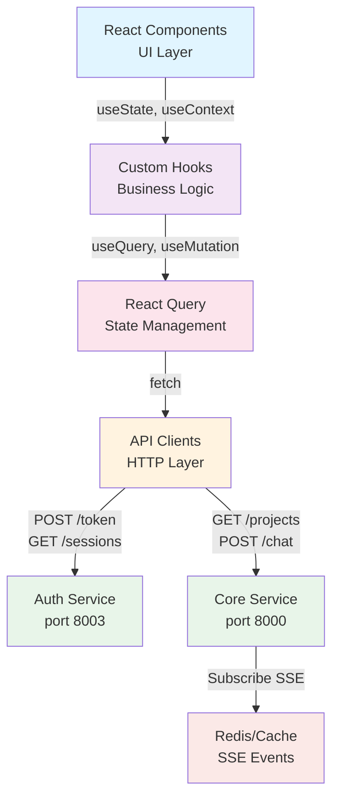

---

## 2. Component Tree Architecture

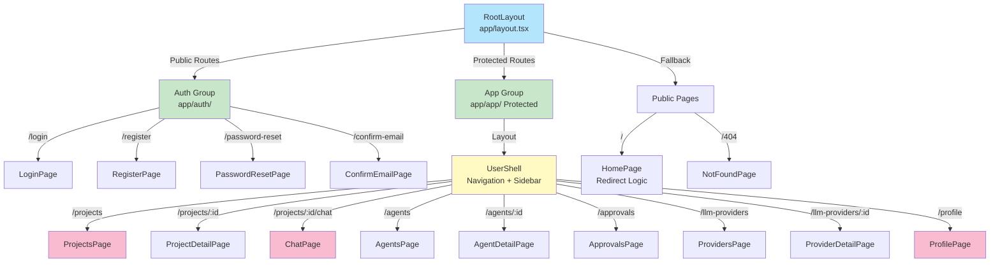

---

## 3. Projects Page Component Tree

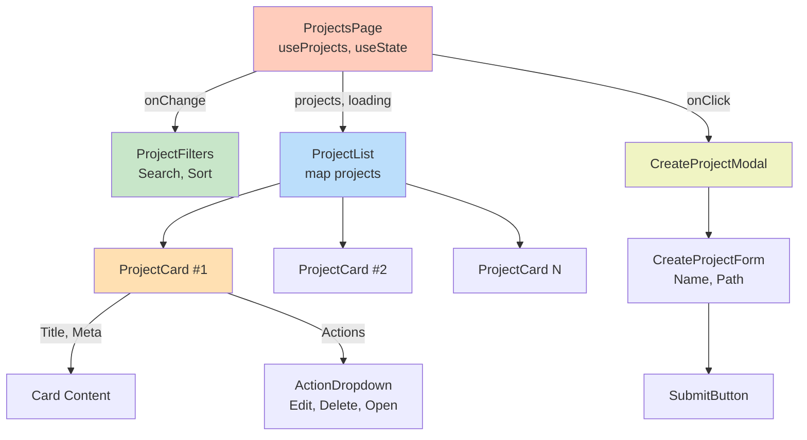

---

## 4. Chat Page Component Tree

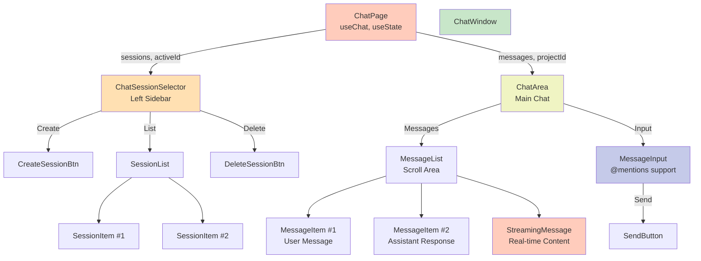

---

## 5. State Management with React Query

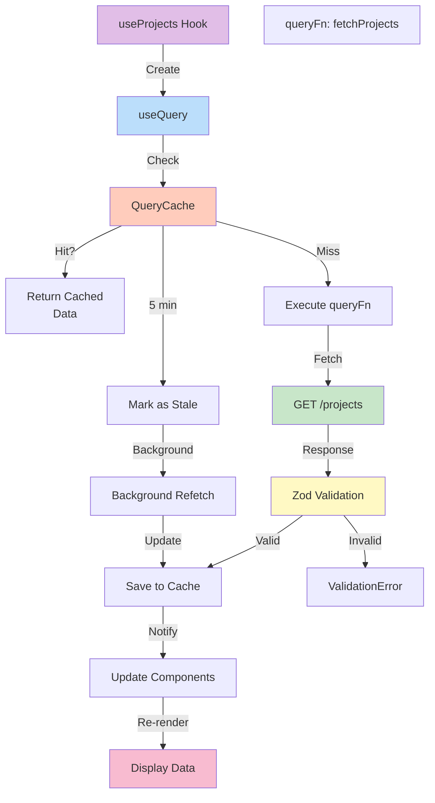

---

## 6. Authentication Flow (Login)

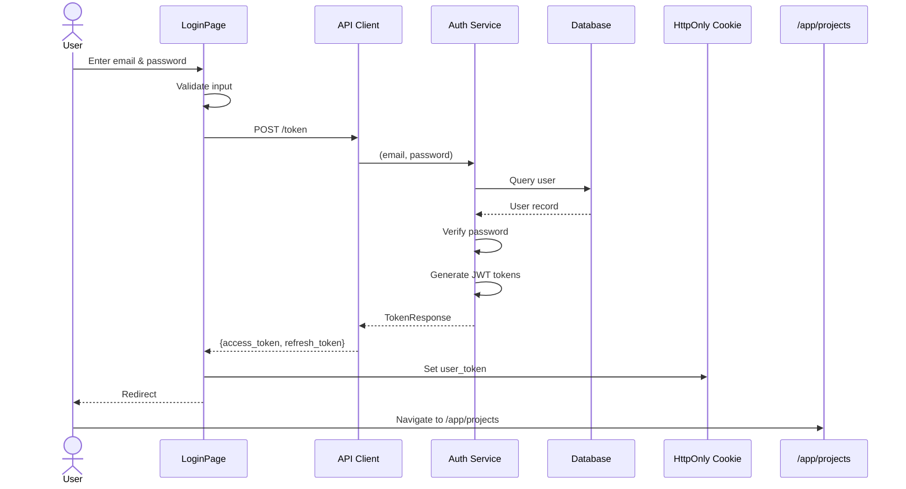

---

## 7. Token Refresh Auto-Flow

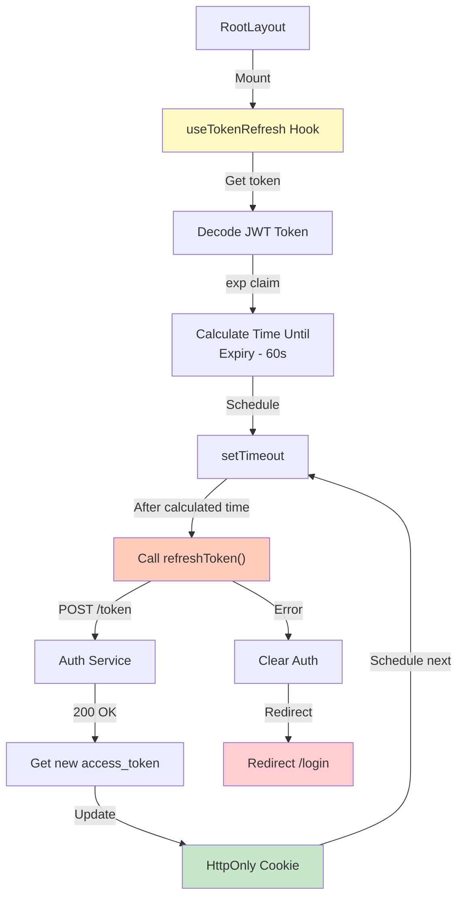

---

## 8. Chat SSE Real-time Flow

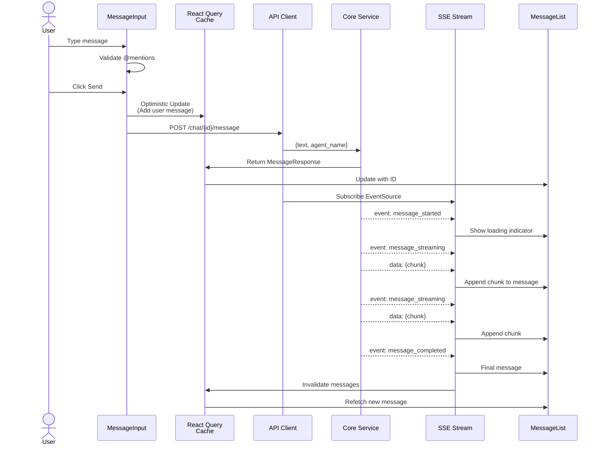

---

## 9. Error Handling Flow

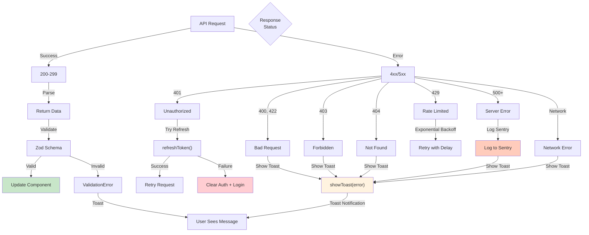

---

## 10. Middleware Route Protection

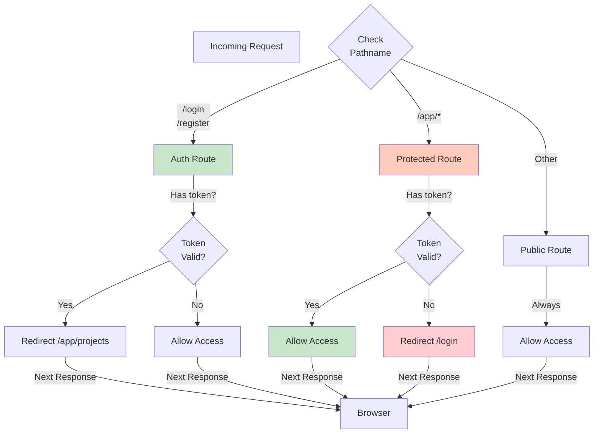

---

## 11. API Integration Map

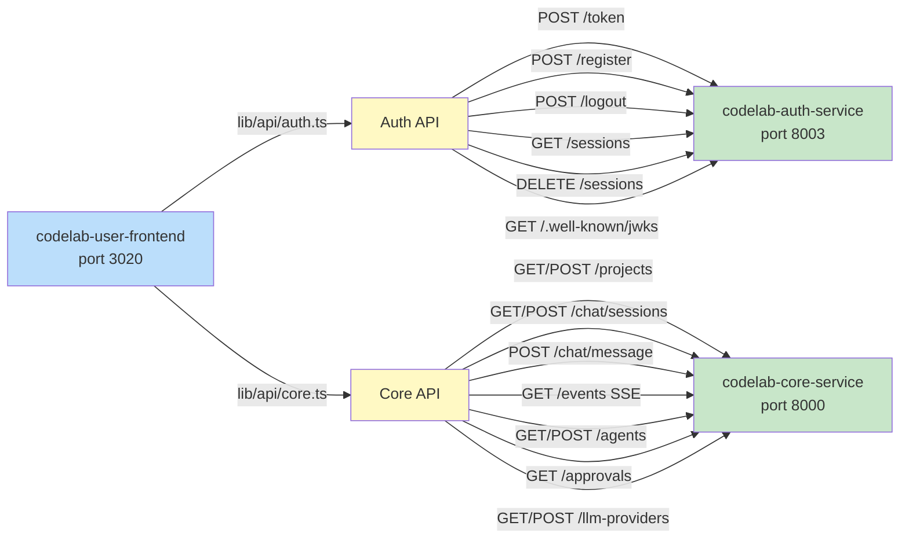

---

## 12. Build & Deployment Pipeline

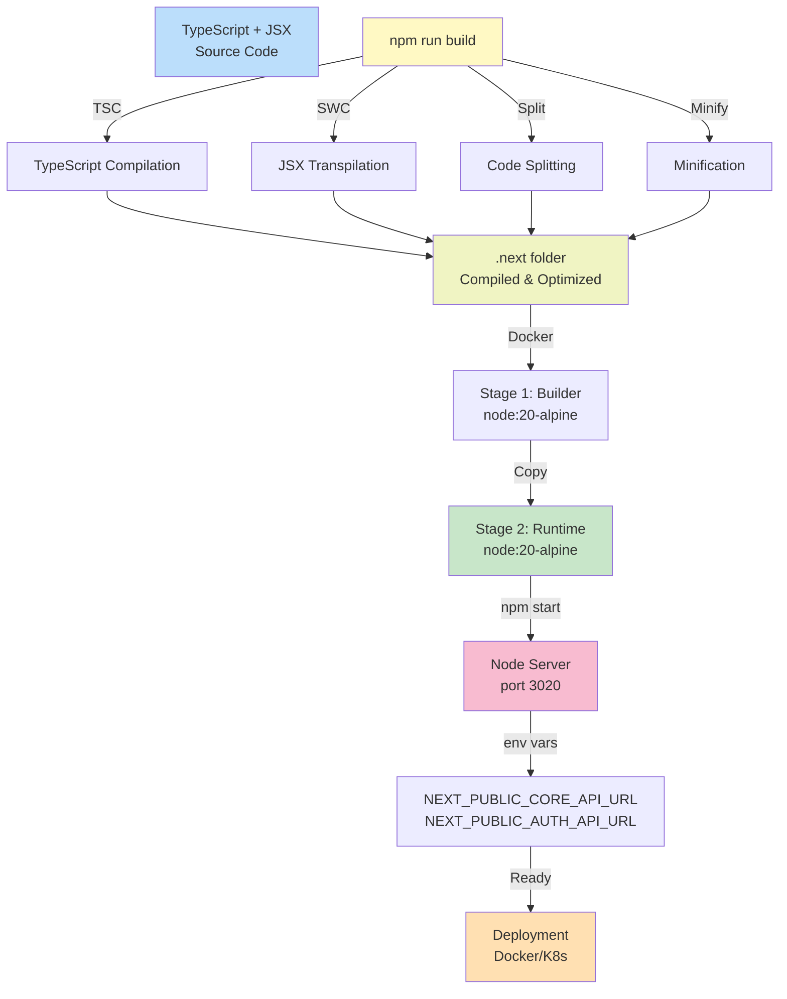

---

## 13. Performance Optimization Strategy

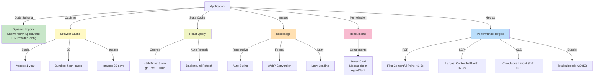

---

## 14. Approval Request Flow

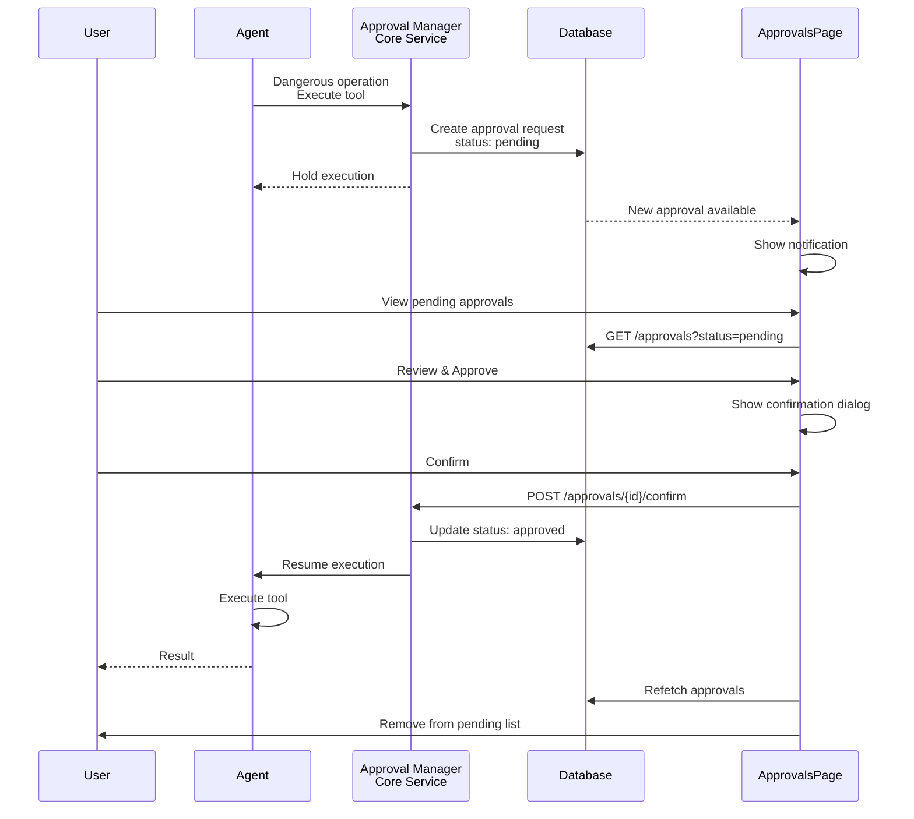

---

## 15. Data Types & Validation

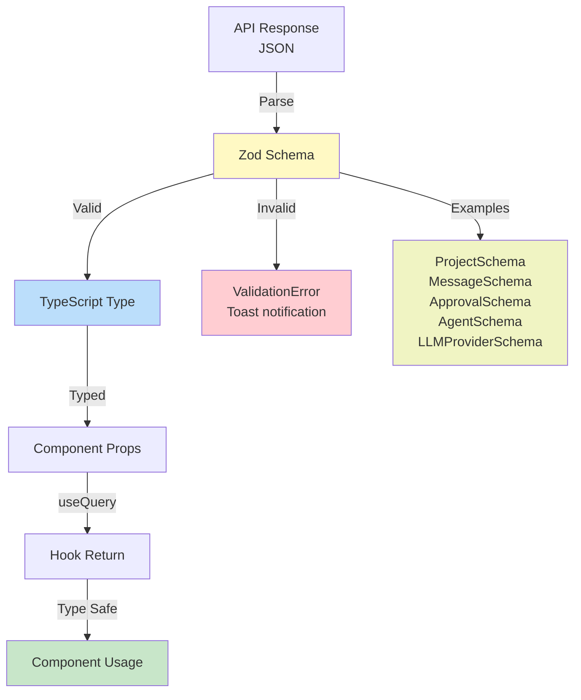

---

## 16. Full Login to Projects Page Sequence

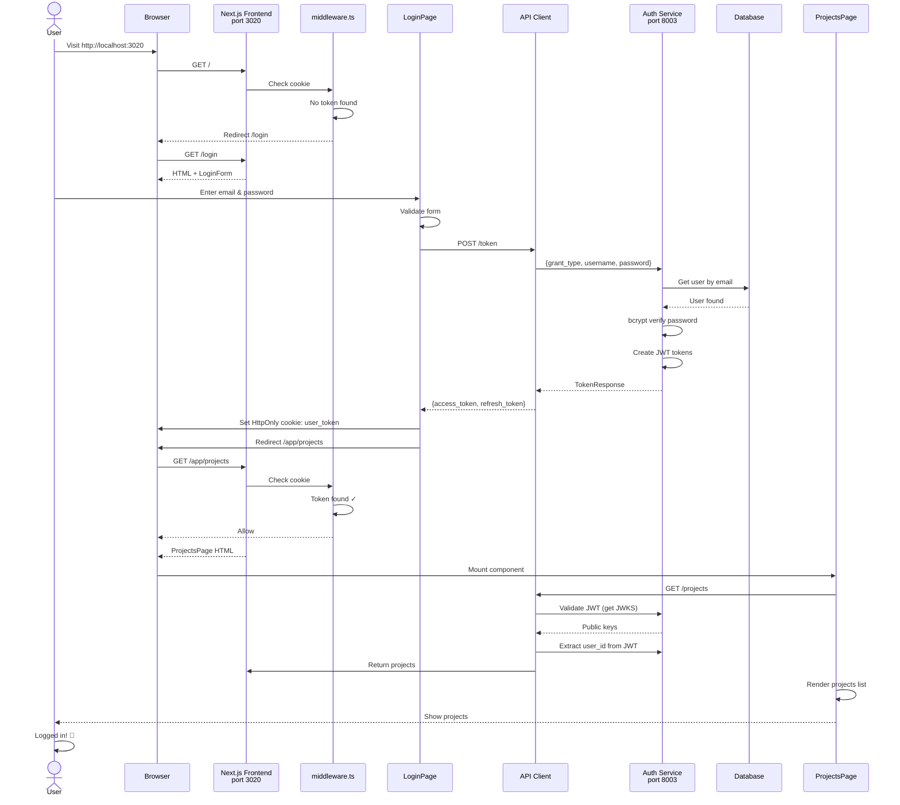

---

## 17. Chat Message Lifecycle

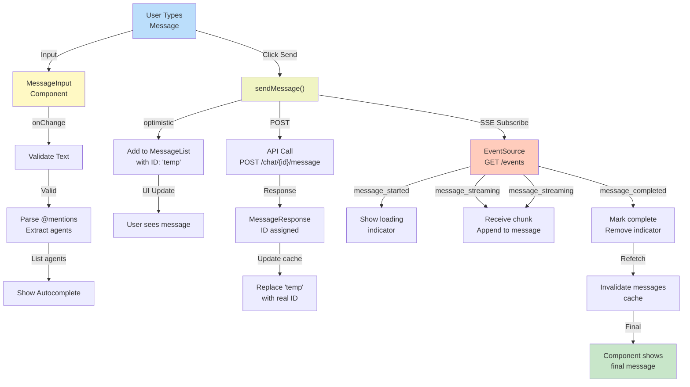

---

## 18. Project CRUD Operations

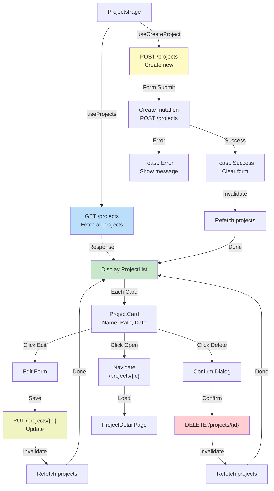

---

## Резюме диаграмм

Все диаграммы покрывают:

✅ **Data Flow** - высокоуровневый поток данных  
✅ **Component Architecture** - иерархия компонентов  
✅ **State Management** - React Query  
✅ **Authentication** - Login flow и auto-refresh  
✅ **Real-time Updates** - SSE streaming для чата  
✅ **Error Handling** - стратегия обработки ошибок  
├─ Retry on 429 (Rate limit) ✓
├─ Retry on 500+ (Server error) ✓
├─ Retry on network error ✓
├─ Don't retry on 400-499 (Client errors) ✗
└─ Don't retry on 401 unless token refresh succeeded ✗
```

---

## 8. Component Props Flow диаграмма

```
┌──────────────────────────────────────────────────────────────────────────┐
│                    PROJECTS PAGE - PROPS FLOW                            │
└──────────────────────────────────────────────────────────────────────────┘

ProjectsPage
     │
     ├─ useProjects() → { data, isLoading, error }
     ├─ useCreateProject() → { mutate, isPending }
     ├─ useState(filters, searchQuery)
     │
     ├─ Pass down:
     │  │
     │  ├─> ProjectFilters
     │  │   ├─ filters: FilterState
     │  │   ├─ onFilterChange: (filters) => void
     │  │   └─ onSearch: (query) => void
     │  │
     │  └─> ProjectList
     │      ├─ projects: Project[]
     │      ├─ isLoading: boolean
     │      ├─ error?: Error
     │      ├─ onProjectDeleted: (id) => void
     │      │
     │      └─> ProjectCard (map)
     │          ├─ project: Project
     │          ├─ onDelete: () => void
     │          ├─ onEdit: () => void
     │          ├─ onOpen: () => void
     │          │
     │          └─> ActionDropdown
     │              ├─ items: MenuItem[]
     │              ├─ onClick: (action) => void

┌──────────────────────────────────────────────────────────────────────────┐
│                    CHAT PAGE - PROPS FLOW                                │
└──────────────────────────────────────────────────────────────────────────┘

ChatPage
     │
     ├─ useChat(projectId) → { sessions, messages, sendMessage }
     ├─ useState(activeSessionId)
     │
     ├─ Pass down:
     │  │
     │  ├─> ChatWindow
     │  │   ├─ projectId: string
     │  │   ├─ sessions: ChatSession[]
     │  │   │
     │  │   ├─> ChatSessionSelector
     │  │   │   ├─ sessions: ChatSession[]
     │  │   │   ├─ activeId: string
     │  │   │   ├─ onSelect: (id) => void
     │  │   │   ├─ onCreate: () => void
     │  │   │   └─ onDelete: (id) => void
     │  │   │
     │  │   └─> ChatArea
     │  │       ├─ messages: Message[]
     │  │       ├─ isLoading: boolean
     │  │       │
     │  │       ├─> MessageList
     │  │       │   ├─ messages: Message[]
     │  │       │   ├─ streaming: StreamingMessage
     │  │       │   │
     │  │       │   └─> MessageItem (map)
     │  │       │       ├─ message: Message
     │  │       │       ├─ isStreaming: boolean
     │  │       │       ├─ avatar: string
     │  │       │       └─ timestamp: Date
     │  │       │
     │  │       └─> MessageInput
     │  │           ├─ agents: Agent[] (for @mentions)
     │  │           ├─ disabled: boolean
     │  │           ├─ onSend: (text) => void
     │  │           └─ onMention: (agent) => void
```

---

## 9. Middleware Protection Flow диаграмма

```
┌──────────────────────────────────────────────────────────────────────────┐
│                    NEXT.JS MIDDLEWARE FLOW                               │
└──────────────────────────────────────────────────────────────────────────┘

Request comes in
     │
     ▼
middleware.ts
     │
     ├─ Get cookies (user_token)
     ├─ Get pathname
     │
     ├─ Check if public route
     │  ├─ /login, /register, /password-reset, /confirm-email
     │  │  ├─ Has token?
     │  │  │  ├─ Yes → Redirect to /app/projects
     │  │  │  └─ No → Allow
     │  │  
     │  └─ Continue to next middleware
     │
     ├─ Check if protected route (/app/...)
     │  ├─ Has token?
     │  │  ├─ Yes → Allow
     │  │  └─ No → Redirect to /login
     │
     └─ Continue to route handler

┌──────────────────────────────────────────────────────────────────────────┐
│                   PROTECTED ROUTE WRAPPER                                │
└──────────────────────────────────────────────────────────────────────────┘

ProtectedRoute Component
     │
     ├─ useAuth() → { isAuthenticated, isLoading }
     │
     ├─ isLoading?
     │  ├─ Yes → <LoadingSpinner />
     │  │
     │  └─ No
     │     ├─ isAuthenticated?
     │     │  ├─ Yes → <>{children}</>
     │     │  └─ No → <Navigate to="/login" />
     │
     └─ Allow children rendering

Usage:
<ProtectedRoute>
  <ProjectsPage />
</ProtectedRoute>
```

---

## 10. Token Lifecycle диаграмма

```
┌──────────────────────────────────────────────────────────────────────────┐
│                      TOKEN LIFECYCLE TIMELINE                            │
└──────────────────────────────────────────────────────────────────────────┘

Time: 0s - User login
     │
     ├─ POST /token (Password Grant)
     ├─ Receive: access_token (exp: 1800s = 30 min)
     ├─ Receive: refresh_token
     ├─ Store in HttpOnly cookie
     └─ Schedule refresh at 1740s (29 min)

Time: 1740s (29 min later)
     │
     ├─ useTokenRefresh hook fires
     ├─ POST /token (Refresh Grant)
     ├─ Receive new access_token
     ├─ Update cookie
     └─ Schedule next refresh

Time: ∞ (ongoing)
     │
     ├─ Every 30 min: auto-refresh happens
     ├─ No user action needed
     ├─ Seamless background refresh
     └─ Token always fresh

User makes request at any time:
     │
     ├─ If within 30 min window
     │  ├─ Token valid ✓
     │  └─ Request succeeds
     │
     └─ If at refresh boundary
        ├─ Refresh happens automatically
        ├─ Request uses new token
        └─ Request succeeds

If refresh fails (network error):
     │
     ├─ Keep using current token
     ├─ Retry refresh at next interval
     └─ If request fails with 401 → Manual login required

User logout:
     │
     ├─ POST /logout
     ├─ Clear cookies
     ├─ Stop refresh timer
     ├─ Redirect to /login
     └─ TokenRefresh hook cleanup
```

---

## 11. Build & Deploy Flow диаграмма

```
┌──────────────────────────────────────────────────────────────────────────┐
│                    BUILD & DEPLOYMENT FLOW                               │
└──────────────────────────────────────────────────────────────────────────┘

Source Code (TypeScript + JSX)
     │
     ├─ npm run build
     │
     ├─ Next.js Compiler
     │  ├─ Parse TypeScript
     │  ├─ JSX transpilation
     │  ├─ Code splitting
     │  ├─ Minification
     │  └─ Tree shaking
     │
     ├─ Output: .next folder
     │  ├─ .next/server (SSR code)
     │  ├─ .next/static (CSR bundles)
     │  └─ .next/cache (optimizations)
     │
     ▼
Docker Build
     │
     ├─ Stage 1: Builder
     │  ├─ FROM node:20-alpine
     │  ├─ npm ci
     │  ├─ npm run build
     │  └─ Output: .next folder
     │
     ├─ Stage 2: Runtime
     │  ├─ FROM node:20-alpine
     │  ├─ Copy .next folder
     │  ├─ Copy package.json
     │  ├─ npm ci --omit=dev
     │  └─ EXPOSE 3020
     │
     ▼
Docker Image
     │
     ├─ Push to registry
     ├─ Tag: codelab-user-frontend:latest
     │
     ▼
Kubernetes Deployment (or Docker Compose)
     │
     ├─ Create pod
     ├─ Set env variables:
     │  ├─ NEXT_PUBLIC_CORE_API_URL
     │  ├─ NEXT_PUBLIC_AUTH_API_URL
     │  └─ NODE_ENV=production
     │
     ├─ Start: npm start (on port 3020)
     │
     └─ Available at: http://localhost:3020
```

---

## 12. Performance Optimization Flow диаграмма

```
┌──────────────────────────────────────────────────────────────────────────┐
│                   PERFORMANCE OPTIMIZATIONS                              │
└──────────────────────────────────────────────────────────────────────────┘

Code Splitting
     │
     ├─ Dynamic imports for heavy components
     │  ├─ ChatWindow → Load on demand
     │  ├─ AgentDetail → Load on demand
     │  └─ LLMProviderConfig → Load on demand
     │
     ├─ Route-based code splitting
     │  ├─ /projects chunk
     │  ├─ /chat chunk
     │  ├─ /agents chunk
     │  └─ /profile chunk
     │
     └─ Lazy loading fallback: <LoadingSpinner />

Caching Strategy
     │
     ├─ Browser cache (HTTP)
     │  ├─ Static assets: 1 year
     │  ├─ Images: 30 days
     │  └─ JS bundles: 1 year (hash-based)
     │
     ├─ React Query cache
     │  ├─ staleTime: 5 min
     │  ├─ gcTime: 10 min
     │  └─ Automatic background refetch
     │
     └─ HTTP cache headers
        ├─ Cache-Control: max-age=...
        └─ ETag validation

Image Optimization
     │
     ├─ next/image component
     │  ├─ Automatic responsive sizing
     │  ├─ Format conversion (WebP)
     │  └─ Lazy loading
     │
     └─ Result: 40% smaller images

Bundle Analysis
     │
     ├─ npm run build → Output analysis
     ├─ Identify large packages
     ├─ Tree-shake unused code
     └─ Optimize imports

Memoization
     │
     ├─ React.memo for expensive components
     │  ├─ ProjectCard
     │  ├─ MessageItem
     │  └─ AgentCard
     │
     └─ useMemo/useCallback for computations

Result:
     │
     ├─ FCP: < 1.5s
     ├─ LCP: < 2.5s
     ├─ CLS: < 0.1
     └─ Total bundle: < 200KB (gzipped)
```

---

## 13. Sequence Diagram: Full Login Flow

```
Client                    Frontend               Auth Service             Database
  │                           │                      │                        │
  │─ Opens /login ────────────>│                      │                        │
  │                           │                      │                        │
  │<─ HTML page (login form) ──│                      │                        │
  │                           │                      │                        │
  │─ Enters email/password ───>│                      │                        │
  │                           │                      │                        │
  │─ Clicks "Login" ──────────>│                      │                        │
  │                           │                      │                        │
  │                           │ POST /token ────────>│                        │
  │                           │ (email, password)    │                        │
  │                           │                      │─ Query user ──────────>│
  │                           │                      │<─ User data ───────────│
  │                           │                      │                        │
  │                           │                      │─ Verify password ──────│
  │                           │                      │                        │
  │                           │                      │─ Generate tokens ──────│
  │                           │                      │  - access_token (JWT)  │
  │                           │                      │  - refresh_token       │
  │                           │                      │  - expires_in: 1800    │
  │                           │                      │                        │
  │                           │<─ TokenResponse ─────│                        │
  │                           │  (access, refresh)   │                        │
  │                           │                      │                        │
  │<─ Set HttpOnly cookie ─────│ Set-Cookie header   │                        │
  │  (user_token)              │ Set-Cookie header   │                        │
  │                            │ (refresh_token)     │                        │
  │                           │                      │                        │
  │<─ Redirect /app/projects ──│                      │                        │
  │                           │                      │                        │
  │─ GET /app/projects ──────>│                      │                        │
  │                           │ [With cookies]       │                        │
  │<─ Projects page ──────────│                      │                        │
  │  + useTokenRefresh hooks  │                      │                        │
```

---

## Резюме диаграмм

Эти диаграммы охватывают:

✅ **Data Flow** - как данные движутся через приложение  
✅ **Component Architecture** - иерархия компонентов  
✅ **State Management** - React Query flow и кэширование  
✅ **Authentication** - Login flow и token refresh  
✅ **Real-time Chat** - SSE streaming и обновления  
✅ **API Integration** - интеграция с backend сервисами  
✅ **Error Handling** - стратегия обработки ошибок  
✅ **Token Lifecycle** - управление токенами на протяжении сессии  
✅ **Middleware & Protection** - защита приватных маршрутов  
✅ **Performance** - оптимизация и кэширование  
✅ **Build & Deploy** - процесс сборки и развертывания  
✅ **Sequence Diagram** - полный flow логина
